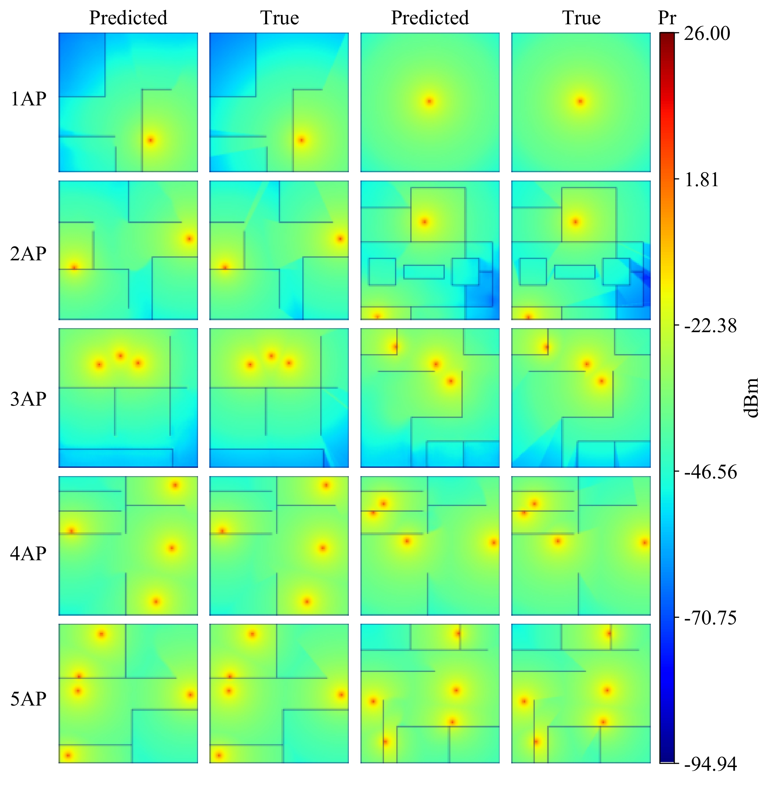
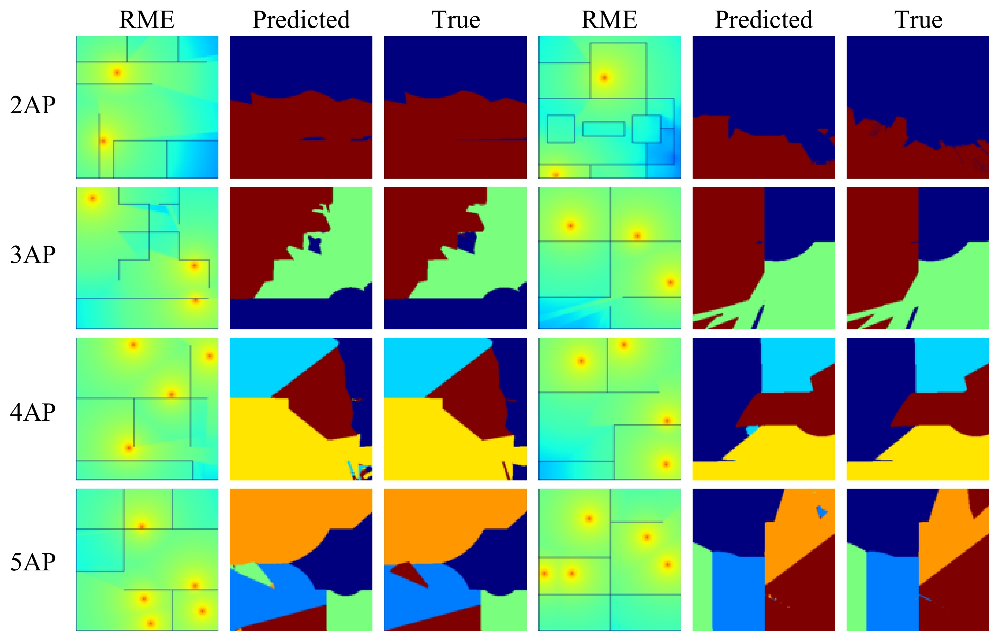

# Fast-Indoor-Radio-Propagation-Prediction-Using-Deep-Learning

En esta investigación, se presenta la arquitectura de Deep Learning [UNet](https://arxiv.org/abs/1505.04597) para el cálculo rápido de Radio Maps Estimation (RME) y Cells Maps Estimation (CME) en escenarios interiores. Esta arquitectura fue implementada para estructuras WLAN conformadas por 1, 2, 3, 4 y 5 puntos de acceso, la cual tiene la capacidad de realizar RME y CME, de forma similar que un simulador físico, pero de forma rápida.

Un punto de referencia importante en el estado del arte fue [RadioUNet](https://github.com/RonLevie/RadioUNet), que es una aplicación para estimar la pérdida de trayectoria de propagación en escenarios exteriores.

### Estructura general de la base de datos.

Una gran díficultad inicial para el comienzo de la investigación, fue la falta de datos, en este caso, planos de escenarios de interiores, mapas de cobertura y de área de cobertura, para el entrenamiento de la arquitectura [UNet](https://arxiv.org/abs/1505.04597). Por lo que fue necesario realizar la creación de una base de datos adecuada, que diera lugar a los respectivos entrenamientos. Dichos mapas de cobertura, se generaron utilizando el modelo [WiFi IEEE](https://mentor.ieee.org/802.11/dcn/03/11-03-0940-04-000n-tgn-channel-models.doc). Dicha implementación se realizó en el software [MATLAB](https://github.com/johanflorez98/Radio-Indoor-Propagation-Software).

Es por lo anterior, que la presente investigación, aporta una [base datos](https://doi.org/10.5281/zenodo.8092621) que puede ser usada para el entrenamiento de múltiples arquitecturas de Deep Learning y con ella se podrían llevar a cabo investigaciones futuras de problemas similares.

### Modelos obtenidos

Para evaluar los [modelos obtenidos](https://drive.google.com/drive/folders/1n9ueD2F4knkeq1Iy1Bo9x6QO6vv7opZf?usp=sharing) se puede utilizar del dataset los planos 61 to 80 con 50 disrtribuciones disponibles para cada uno como conunto de prueba dispuesto u otras imagenes nuevas. 

### RME Prediction

Se muestra acontinuación una matriz de imagenes del conjunto de prueba y sus respectivos RME generados a partir de los modelos para cada una de las configuraciones de WLAN establecidas:

### CME Prediction

Se muestra acontinuación una matriz de imagenes del conjunto de prueba y sus respectivos CME generados a partir de los modelos para cada una de las configuraciones de WLAN establecidas:

